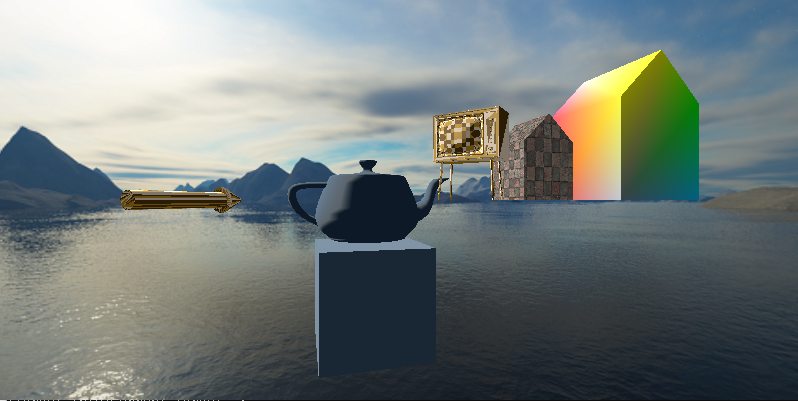
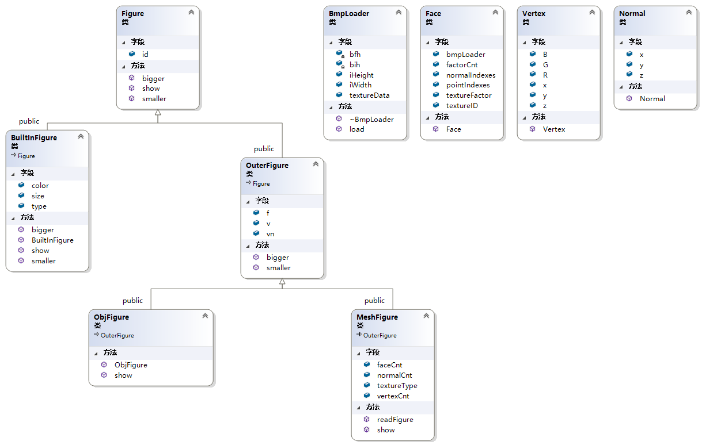

# Computer Graphics 大作业

环境：Visual Studio 2019 (freeglut)



* 优化摄像机的移动逻辑

   WASD 可以控制摄像机以当前视角前后左右移动，不受限于坐标轴

* 支持物体放大缩小旋转 / 支持摄像头锁定到物体上

* 添加天空盒

## 操作方式

| Key        | Effect                                                       |
| ---------- | ------------------------------------------------------------ |
| `w` or `s` | 前后移动                                                     |
| `a` or `d` | 左右移动                                                     |
| `z` or `x` | 上下移动                                                     |
| `q` or `e` | 绕`y`轴旋转(水平面内)                                        |
| `r` or `t` | 绕`x`轴旋转                                                  |
| `f` or `g` | 绕`z`轴旋转                                                  |
| `m`        | 切换控制对象（`0`为摄像机，其他为物体）                      |
| `l`        | 开关光照                                                     |
| `j`        | 开关参考线                                                   |
| `k`        | 将摄像机和当前物体的相对位置锁定或解锁（即摄像机跟随物体移动） |
| `[` or `]` | 缩小或放大当前物体                                           |
| `o`        | 复位所有物体 |
| `p` | 退出                                     |

## config配置文件

为了在降低程序和配置的耦合度，设计了配置文件。

```python
2  # 配置项个数
ANGLE_STEP 3  # 移动步长
MOVE_STEP 0.2 # 旋转步长
6  # 绘制图形个数
# 第一类：内置图形，目前仅支持(WIRE_)TEA_PORT和(WIRE_)CUBE
# 格式：类型 尺寸 R G B (颜色)
TEA_PORT 1 0.1 0.2 0.3 
CUBE 1 0.2 0.3 0.4
# 第二类：Mesh文件图形
# 格式：FILE mesh文件路径 纹理文件路径
FILE mesh\1.mesh mesh\2.texture
FILE mesh\2.mesh mesh\1.texture
# 第三类：Obj文件图形 (目前不支持纹理)
# 格式：OBJ obj文件路径
OBJ obj\arrow_up.obj
OBJ obj\tv.obj
```

## 外部模型配置配置

`.mesh`文件为标准格式，记录顶点、法向量和面信息，这里着重介绍`.texture`格式：

* 纹理模式

  ```python
  T
  # 每个面对应一行，定义顺序和mesh文件中一致
  # 格式：纹理文件路径 顶点1x 顶点1y ... 顶点nx 顶点ny
  mesh/t1.bmp 0 0 0 1 1 1 1 0
  mesh/t1.bmp 0 0 0 1 1 1 1 0
  mesh/t1.bmp 0 0 0 1 1 1 1 0
  mesh/t1.bmp 0 0 0 1 1 1 1 0
  mesh/t1.bmp 0 0 0 1 1 1 1 0
  mesh/t1.bmp 0 0 1 0 1 0.67 0.5 1 0 0.67
  mesh/t1.bmp 1 0 1 0.67 0.5 1 0 0.67 0 0
  ```

* 色彩模式

  ```python
  C
  # 每个顶点对应一行，表示顶点颜色，定义顺序和mesh文件中一致
  # 格式: R G B
  255 0 0
  0 255 0
  0 0 255
  255 182 193
  220 20 60
  112 128 144
  0 191 255
  0 255 0
  255 255 0
  255 255 0
  ```


## 核心类设计图


